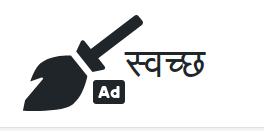

# Swaccha Adblock Filter

<a href="https://sndsabin.github.io/swaccha-adblock-filter/" target="_blank" rel="noreferrer noopener">Swaccha</a> is a collection of static adblock filters for various popular Nepali sites. It helps you keep
            annonying
            ads away from various popular Nepali sites.

## ⚠ IMPORTANT ⚠

> **This is not a universal solution to get rid of ads for all popular Nepali sites.**

## Usage

**For usage instructions, please visit [swaccha adblock filter docs](https://sndsabin.github.io/swaccha-adblock-filter/).**

## Supported Adblockers

- Adblock
- Adblock Plus
- uBlock Origin
- Adguard AdBlocker

## Didn't work ? Site missing from the list ?

It's possible that the site might have recently updated it's layout or has changed it's ad url pattern or the filter list hasn't been updated. The filter rule for the site could be missing from the list. If so, Please feel free to [create an issue](https://github.com/sndsabin/swaccha-adblock-filter/issues/new) or [open a pull request](https://github.com/sndsabin/swaccha-adblock-filter/pulls).

#### If you need help with creating custom filter. Please refer to the [cheat sheet](https://adblockplus.org/filter-cheatsheet)

## License

[ISC](LICENSE)

**Inspired from [anti-adblock-killer](https://github.com/reek/anti-adblock-killer).**
